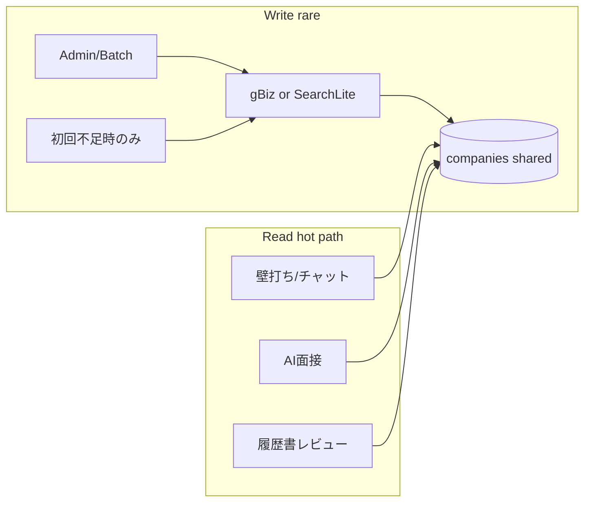

# 企業情報取得方式の設計（#557）

> 目的: 正確な企業事実を必要なだけ取得しつつ、**7,000ユーザー規模・壁打ち（反復利用）でも月次コストが破綻しない**構成にする。  
> LLM は「最新テキストの抽出器」として使うが、**ユーザー操作のたびに Search してはいけない**。

関連: Issue [#557](https://github.com/ISCProduct/soc-ai-agent/issues/557) / Backlog `SOCAIAGENT-29`  
実測（2026-07）: 企業基本情報の Search Lite→Parse は 1社あたり約 **$0.025（ほぼ検索ツール料金）**

---

## 0. スケール前提（必須制約）

### 0.1 利用モデル

| 層 | 誰が・いつ | 期待回数 | Search を呼んでよいか |
|----|------------|----------|----------------------|
| **Write（企業ナレッジ更新）** | admin / バッチ / 企業が DB に無い初回だけ | 企業ユニーク × 低頻度 | **条件付きで可**（TTL 外のみ） |
| **Read（壁打ち・面接・チャット・レビュー）** | 全ユーザー・反復 | ユーザー × セッション × ターン | **禁止（$0）**。DB/キャッシュのみ |

壁打ち相手として使う場合、1ユーザーが同一企業で **数十〜数百ターン** 会話する。ここに Search や企業プロファイル LLM を挟むと、ユーザー数に比例してコストが爆発する。

### 0.2 7,000ユーザーのコスト感覚（実測ベース）

実測: 基本情報 1取得 ≈ **$0.025**（Search ツール約 $0.025 + トークンは誤差）

| シナリオ | 計算 | 月額概算 |
|----------|------|----------|
| ❌ 壁打ち1回ごとに企業 Search | 7,000人 × 月10回 × $0.025 | **約 $1,750（≈27万円）** ※基本情報だけ |
| ❌ 同上 + 求人/Tech/Hints | ×3〜5 | **約 $5,000〜9,000（≈80〜140万円）** |
| ❌ 面接開始ごとに `lookupCompanyProfile`（モデル呼び出し） | 7,000 × 月5回 × トークン代 | 小額だが無駄＋鮮度なし。Search 化しなくても DB へ寄せるべき |
| ✅ **企業ユニーク共有キャッシュ**（月新規 500社のみ Search） | 500 × $0.025 | **約 $12.5（≈2,000円）** |
| ✅ 同上 + 求人/Tech も新規のみ | 500 × $0.075 | **約 $37.5（≈6,000円）** |
| ✅ 壁打ち・面接 Read | DB のみ | **Search $0** |

**結論:** コスト最適化の本体はモデル選定ではなく **「誰の・どの操作が Search を発火するか」の分離**。7,000人規模では **企業ナレッジはプロダクト共有資産** として持ち、ユーザーセッションはそれを読むだけにする。

### 0.3 設計原則（スケール用）

1. **Company-level cache（共有）**: `companies` 行＋ `*_fetched_at` が唯一の正。ユーザーごと・セッションごとに再取得しない  
2. **Read path = zero Search**: 壁打ち / 面接 / チャット / 履歴書レビューのホットパスから Search・企業プロファイル LLM を除去  
3. **Write path = rare**: admin 手動、夜間バッチ、または「DB に企業がない / TTL 切れ」の初回だけ  
4. **単一フライト**: 同一 `company_id` の同時取得は1本にまとめる（thundering herd 防止）  
5. **予算ガード**: 月間 Search 回数のソフト上限（例: 2,000回 ≈ $50）と admin アラート  
6. **壁打ち用コンテキストは短いスナップショット**: DB から 300〜800字に trim した `company_brief` をプロンプトに載せる（毎回 LLM で企業調査しない）



---

## 1. 調査サマリ（結論）

| 問い | 結論 |
|------|------|
| 7,000人でも現実的か | **企業共有キャッシュ + Read 禁止 Search** なら月数百〜数千円〜数万円で収まる。ユーザー比例 Search は不可 |
| 正確さはどう担保するか | Write 時だけ AI Search Lite で事実取得。gBiz は足がかり（カバー不足時は AI） |
| 壁打ちで毎回調べるべきか | **すべきでない**。調べた結果を DB に溜め、壁打ちはそれを使う |
| トークン 50% 削減は可能か | Write 経路の最適化に加え、Read 経路の LLM 企業調査削減が桁違いに効く |

**現状の最大問題（コスト）:** 面接 `lookupCompanyProfile` や RAG hints/web_search が **セッション単位で外部/LLM 調査**しうる。スケール前に Read 経路を DB 参照へ寄せる必要がある。

---

## 2. 現行パス棚卸し

### 2.1 取得経路一覧

| 用途 | 実装 | 実体 | モデル | 鮮度 | FE / 呼び出し |
|------|------|------|--------|------|---------------|
| 企業基本情報 | `CompanyInfoFetcher.FetchAndSave` | モデル知識 | `OPENAI_MODEL` / mini, max 600 | ❌ | `POST .../fetch-info`、バッチ `fetch_info_all` |
| 企業基本（プレビュー） | `WebSearchCompanyInfo` | モデル知識（名前が WebSearch） | 同上 | ❌ | admin `companies/[id]/info` |
| 求人 | `CareersScraper.FetchJobs` → `JobFetchService` | モデル知識（`Source: ai_knowledge`） | mini, max 1500 | ❌ | `.../fetch-jobs` |
| 人物像 | `JobFetchService.FetchAndSavePersona` | DB テキスト → LLM | mini, max 500 | △（DB依存） | `.../fetch-persona` |
| 技術スタック | `FetchTechStack` | モデル知識 | mini, max 400 | ❌ | `.../tech-stack-search` |
| 企業関係 | `EnrichRelations` / `fetchRelationsWithLLM` | モデル知識（`SourceType: llm_web_search`） | mini, max 800 | ❌ | `POST .../enrich-relations` |
| 公的データ | `GBizInfoService` | gBizINFO API | なし | ✅（API依存） | gBiz sync / search |
| 就活サイト | `tools/company-graph` + `Backend/internal/scraper` | HTML スクレイプ | なし（抽出時は mini） | ✅〜△ | company-graph crawl |
| クロール抽出 | `CrawlService` + OpenWork | HTML → LLM 抽出 | mini, HTML 最大約 12k 字 | ✅（ページ鮮度） | crawl sources |
| 企業実在確認 | `CompanyValidationService` | **DB → WebSearchJSON**（max 200） | `OPENAI_WEB_SEARCH_MODEL` | ✅ | `/api/companies/validate`（履歴書） |
| 候補検索 | `WebSearchCompanies` | WebSearch、失敗時はモデル知識 | search-preview / mini | △ | `/api/companies/web-search` |
| 面接ヒント | RAG `_run_hints_web_search_pipeline` | **真の Web Search ×3 → 要約 → Parse** | search-preview + chat + parse | ✅ | `/company/hints` |
| 面接 realtime プロフィール | `lookupCompanyProfile` | モデル知識（Responses） | デフォルトモデル | ❌ | Interview BE のみ |
| 履歴書/ES 文脈 | RAG `_run_web_search_pipeline` / Deep Research | 真の Search | search-preview 等 | ✅ | resume/ES → RAG |

### 2.2 OpenAI クライアント能力

`Backend/internal/openai/client.go`:

| API | 用途 | 既定モデル env |
|-----|------|----------------|
| `ChatCompletionJSON` | JSON 抽出・モデル知識 | `OPENAI_MODEL`（`gpt-4o-mini`） |
| `WebSearchJSON` | 短文 Web 検索 JSON | `OPENAI_WEB_SEARCH_MODEL`（`gpt-4o-search-preview`） |
| `Responses*` | realtime / プロフィール等 | `OPENAI_MODEL` 系 |

### 2.3 DB の鮮度メタデータ（現状）

`companies`（`Backend/internal/models/company.go`）:

- あり: `SourceType`, `SourceURL`, `SourceFetchedAt`, `GBizLastSyncedAt`, `GBizSyncStatus`
- **なし:** `confidence`, `model_used`, フィールド単位の `*_fetched_at`

`company_relations` に source / fetched_at はなく、説明文に `llm_web_search:...` を埋め込む程度。  
Validation の `confidence` は **メモリキャッシュ（30分）のみ**で永続化されない。

### 2.4 env / 実装のずれ

| 変数 | 意図 | 実態 |
|------|------|------|
| `OPENAI_HINTS_MODEL` | RAG hints の Search | `rag/main.py` は **`OPENAI_WEB_SEARCH_MODEL`** を参照。HINTS_MODEL は未使用 |
| `OPENAI_HINTS_PARSE_MODEL` | hints JSON 化 | RAG で使用（既定 `gpt-4o`） |
| `OPENAI_WEB_SEARCH_MODEL` | Go `WebSearchJSON` + RAG Search | `.env.example` に **未記載** |
| Brave Search MCP | `mcp/README.md` | **`compose.mcp.yml` がリポジトリに存在しない**。アプリコードからの呼び出しもなし |

### 2.5 参考になる既存パターン

1. **`CompanyValidationService`（推奨の原型）**  
   キャッシュ → DB → 必要時のみ `WebSearchJSON`（max 200）。根拠 URL・confidence・source を返す。
2. **RAG hints 2段**  
   Search（複数クエリ）→ 要約 → Parse。鮮度は良いがクエリ数が多くトークンが重い。企業情報側では **1クエリ + mini parse** に圧縮する。
3. **CrawlService の「HTML → 抽出」**  
   モデル知識ではなく入力テキストからの抽出。#557 の本流に近い。

---

## 3. フィールド別 鮮度要件 × Primary ソース × モデル

| フィールド | 鮮度 | TTL | Primary | Fallback | LLM |
|-----------|------|-----|---------|----------|-----|
| 法人番号・正式名称 | 低 | 365日 | gBizINFO | — | 同名曖昧さ解消時のみ mini |
| 所在地 | 低 | 180日 | gBizINFO | 公式サイト抽出 | 未充足時 mini |
| 従業員数 | 中 | 90日 | gBiz / 有報テキスト | Search-Lite | mini extract |
| 企業概要・事業内容 | 中 | 90日 | 公式サイトスクレイプ | mini-search | mini extract |
| **求人** | **高** | **7日** | careers スクレイプ / 就活サイト | Search-Lite → Parse | **禁止: モデル知識のみ** |
| **技術スタック** | **高** | **30日** | 採用/engineering ページ | Search-Lite → Parse | 同上 |
| 文化・働き方 | 中 | 60日 | 採用ページ | Search-Lite | mini |
| 企業関係 | 中 | 60日 | gBiz 調達/補助金 + 既存グラフ | Search-Full → Parse | mini / 複雑時 4o |
| 平均年齢・女性比率 | 低 | 180日 | gBiz workplace / 有報 | — | 原則 LLM 不要 |

判定ルール: 各フィールドは対応する `info_fetched_at` / `jobs_fetched_at` / `tech_fetched_at` のみで TTL 判定する。  
`SourceFetchedAt` / `GBizLastSyncedAt` は企業レコード全体のメタデータであり、求人・Tech など他フィールドの鮮度判定には使わない。期限内は再取得しない。未充足フィールドのみパイプラインを走らせる。

---

## 4. Search 系モデルの使用条件

### 使ってよい条件

- Primary（gBiz / スクレイプ）が **失敗**、または **URL 不明**
- 高鮮度フィールドが **TTL 超過** かつスクレイプ不能
- UI の企業実在確認・候補補完（Validation と同系統、短文）

### 使ってはいけない条件

- 企業名だけ渡して「知っている求人/Tech/関係を全部出して」
- TTL 内のキャッシュがあるフィールドの再 Search
- 全フィールドを毎回 `gpt-4o-search-preview` で一括生成
- スクレイプ成功済みテキストがあるのに Search を重ねる（Extract のみで足りる）

### 2段構成（Search → Parse）を採用するタスク

| タスク | Search | Parse | 備考 |
|--------|--------|-------|------|
| 求人（スクレイプ失敗時） | mini-search-preview | mini | CareersScraper 移行の本命 |
| 技術スタック（同上） | mini-search-preview | mini | |
| 企業関係（gBiz 不足時） | search-preview | mini（複雑長文は 4o） | 根拠 URL 必須 |
| 企業名 UI 補完 | mini-search（短文） | 不要 or mini | Validation 拡張 |

面接 hints は既に 2 段。企業情報パイプラインとは **env を分離**し、hints 側はクエリ数削減を別 Issue で検討する。

---

## 5. 統合パイプライン（目標アーキテクチャ）

```text
企業名 / company_id / URL
        │
        ▼
[1] gBizINFO 名前検索 → 法人番号確定          (tokens: 0)
        │ TTL 内なら Sync スキップ
        ▼
[2] gBizINFO Sync → 構造化フィールド更新      (tokens: 0)
        │
        ▼
[3] 公式 / 就活 / careers URL スクレイプ      (tokens: 0)
        │ 失敗・URL不明
        ├──────────────────────────────┐
        ▼                              ▼
[4] テキスト trim(500〜1500字)     [3b] Search-Lite
        │                              │
        ▼                              ▼
[5] EXTRACT (gpt-4o-mini)          PARSE (gpt-4o-mini)
        │                              │
        └──────────┬───────────────────┘
                   ▼
[6] 高鮮度フィールドが未充足 / TTL 超過?
        │ Yes → Search-Lite → (不足時のみ Deep Search) → Parse
        ▼
[7] DB 保存: source_type / source_url / *_fetched_at / confidence / model_used
```

### タスク × モデル ルーティング（確定案）

| タスク | Step1 | Step2 | モデル |
|--------|-------|-------|--------|
| 法人番号 | gBiz 名前検索 | 候補≤5 の曖昧さ解消 | mini（必要時） |
| 基本プロファイル | gBiz Sync | 未充足のみ公式スクレイプ→extract | mini |
| 概要 | 公式スクレイプ | extract | mini |
| 求人 | careers / 就活スクレイプ | 失敗時 Search-Lite→Parse | mini-search → mini |
| Tech Stack | 採用ページスクレイプ | 失敗時 Search-Lite→Parse | mini-search → mini |
| 文化 | 採用ページ | extract | mini |
| 関係 | gBiz + 既存グラフ | 不足時 Search-Full→Parse | search-preview → mini/4o |
| UI 実在確認 | DB | WebSearch 短文 | 既存 Validation |

---

## 6. トークン見積もりと目標上限

### 現状（1企業フル取得・モデル知識）

| 呼び出し | max_tokens 目安 | 備考 |
|----------|-----------------|------|
| FetchInfo | 600 | |
| FetchJobs | 1500 | |
| FetchTechStack | 400 | |
| EnrichRelations | 800 | |
| **合計出力上限** | **≈ 3,300** | 入力プロンプト込みで実測 **2,000〜3,000+**、鮮度 ❌ |

### 提案

| シナリオ | 構成 | 推定トークン | 鮮度 |
|----------|------|-------------|------|
| 通常（URL あり） | スクレイプ + mini extract ×2〜3 | **800〜1,200** | ✅ |
| Search フォールバック | Search-Lite×1〜2 + Parse×2 + Extract | **1,500〜2,500** | ✅ |
| 最悪（避ける） | search-preview ×4 | 8,000+ | ✅だが非スケール |

### 目標上限（完了条件）

| 区分 | 上限 |
|------|------|
| 通常ルート（1企業フル） | **1,200 tokens** |
| Search フォールバック込み | **2,500 tokens** |
| UI 実在確認（1クエリ） | **200 tokens**（現行維持） |

目標（仮説）: 現状中央値 ≈2,500 → 提案通常 1,200 で **約 50% 減**を目指す（PoC 10社の実測で検証。未実測の確定値ではない）。

---

## 7. env 変数設計

既存 `OPENAI_MODEL` / HINTS 系と分離する。

```bash
# 抽出（高頻度・低コスト）
OPENAI_COMPANY_EXTRACT_MODEL=gpt-4o-mini

# Web検索（スクレイプ失敗・URL不明時の第一選択）
OPENAI_COMPANY_SEARCH_MODEL=gpt-4o-mini-search-preview

# Web検索フォールバック（不足時のみ）
OPENAI_COMPANY_DEEP_SEARCH_MODEL=gpt-4o-search-preview

# Search結果の構造化（2段目）
OPENAI_COMPANY_PARSE_MODEL=gpt-4o-mini

# 長文・関係抽出の高精度 Parse（必要時のみ）
OPENAI_COMPANY_PARSE_MODEL_ADVANCED=gpt-4o
```

運用メモ:

- Go の既存 `OPENAI_WEB_SEARCH_MODEL` は Validation / 公開 web-search で継続利用可。企業パイプラインは上記に寄せ、段階的に読み替え。
- RAG の `OPENAI_HINTS_MODEL` は **未使用**のため、実装 Issue で `OPENAI_WEB_SEARCH_MODEL` への統一か、hints 専用読込のどちらにするか決める（本設計では企業パイプラインと分離を推奨）。

---

## 8. DB スキーマ案

### 8.1 最小追加（Phase 1）

`companies` に追加:

| カラム | 型 | 用途 |
|--------|-----|------|
| `info_fetched_at` | datetime NULL | 基本情報の最終取得 |
| `jobs_fetched_at` | datetime NULL | 求人 |
| `tech_fetched_at` | datetime NULL | 技術スタック |
| `last_model_used` | varchar(64) NULL | 直近に使ったモデル名 |
| `last_fetch_confidence` | varchar(16) NULL | high/medium/low |

> `relations_fetched_at` は Phase 2（関係 enrich 実装時）で追加する。Phase 1 スキーマには含めない。

既存 `SourceType` / `SourceURL` / `SourceFetchedAt` は「企業レコード全体の出典」として維持。フィールド TTL は上記 `*_fetched_at` で判定。

### 8.2 関係の provenance（Phase 1.5）

`company_relations` に `source_type`, `source_url`, `fetched_at`, `confidence` を追加し、説明文埋め込みをやめる。

### 8.3 既存 `llm_web_search` / `ai_knowledge` データの扱い

| 方針 | 内容 |
|------|------|
| 即削除しない | マッチング・面接が壊れるのを避ける |
| 再取得トリガー | TTL 超過 or admin「強制再取得」or バッチ |
| マーキング | `SourceType` が `llm_web_search` / 求人 `ai_knowledge` のレコードは **鮮度信頼度 low** 扱いし、UI で警告 |
| 上書き規則 | Primary（gBiz/スクレイプ）成功時は必ず上書き。Search 結果は confidence medium 以上のみ上書き |

---

## 9. Brave Search MCP 評価

| 項目 | 評価 |
|------|------|
| 現状 | README のみ。`compose.mcp.yml` 欠落。アプリ未接続 |
| 利点 | OpenAI Search 以外の検索コスト最適化、根拠 URL の明示 |
| 欠点 | 運用面（API キー・MCP プロセス）、Go サービスからの直接呼び出し設計が未整備 |
| 本設計での位置づけ | **Phase 2 候補**。Phase 1 は OpenAI Search-Lite/Full で統一し、インターフェース（`CompanySearchProvider`）だけ抽象化して後から Brave を差し込めるようにする |

---

## 10. 公式サイトスクレイプ（方針・リスク）

| 項目 | 方針 |
|------|------|
| 対象 | 公式 `WebsiteURL`、`/careers` `/recruit` `/engineering` など既知パス |
| robots.txt | 取得前に確認。Disallow はスキップし Search にフォールバック |
| 利用規約 | 就活サイトは既存 company-graph セレクタを優先。規約違反リスクのあるサイトは追加しない |
| テキスト長 | 抽出前に 500〜1,500 字（セクション見出し優先）へ trim |
| 失敗時 | Search-Lite（URL 特定）→ 再スクレイプ or 直接 Parse |

PoC（実装前の確認項目）: 大手〜スタートアップ 10 社で (a) スクレイプ成功率 (b) mini 抽出のフィールド充足率 (c) Search フォールバック率 (d) トークン実測。

---

## 11. CareersScraper 移行設計

現状: `FetchJobs` がモデル知識で `Source: "ai_knowledge"`。

移行後:

```text
1. website_url / 既知 careers URL をスクレイプ
2. 成功 → EXTRACT(mini) → JobPostingResult[]（source=scrape）
3. 失敗 → SEARCH(mini-search) で求人ページ URL/スニペット取得
4. PARSE(mini) → JobPostingResult[]（source=web_search, evidence_urls 必須）
5. jobs_fetched_at 更新。TTL 7日以内はスキップ
```

`JobFetchService` の入口は変えず、内部実装だけ差し替え可能にする。

---

## 12. 段階的移行計画（スケール前提版）

### Phase 1A（現行・Write 経路）

企業ナレッジの **書き込み**を正確・共有化する。

- gBiz 試行 → 不足時 AI Search Lite（`mini-search`→`mini` Parse）
- deep `gpt-4o-search-preview` は企業パイプラインで使わない
- `*_fetched_at` / TTL / provenance / admin UI
- **同一企業の Search は共有 DB に保存**（ユーザー横断で再利用）

### Phase 1B（最優先・Read 経路の Search/$ LLM 調査ゼロ化）

7,000人・壁打ち前提で **ここが本命のコスト削減**。

| 対象 | 現状 | あるべき姿 |
|------|------|------------|
| AI面接 `lookupCompanyProfile` | セッション開始時に LLM 知識で都度生成 | `companies` から brief を読む。無ければ空 or 短文フォールバック。**Search しない** |
| 壁打ち/チャットの企業文脈 | 都度調査しがち | 選択企業の DB スナップショットのみ注入 |
| RAG `/company/hints` | Search×3 の可能性 | 企業単位キャッシュ（Chroma or DB）TTL。ヒット時 $0 |
| 履歴書レビューの web_search | レビュー毎に走りうる | 企業コンテキストは DB 優先。不足時のみ Write 相当を1回 |

受け入れ条件:

- 壁打ち 100 ターンで企業 Search 回数 **0**
- 面接 1 セッションで企業 Search 回数 **0**（DB 既存時）
- 新規企業の初回タッチだけ Write が走る

### Phase 2（単価さら下げ + 運用）

- Search Provider 抽象化 → Brave / 安価検索へ切替可能な設計（ツール料金 $0.025/回を下げたい場合）
- 夜間バッチ: 人気企業・TTL 切れのみ再取得（ユーザー操作と分離）
- 単一フライト・レート制限・月次 Search 予算ガード（`api_call_log`）
- フィールド単位の不足のみ再取得（Info 済みなら Jobs だけ等）

### Phase 3

- EnrichRelations の provenance 化
- RAG と MySQL 企業キャッシュの統合ダッシュボード
- コストアラート（月 $50 / $100 など）

---

## 12.1 壁打ち向けデータ契約

壁打ち/面接プロンプトに渡すのは最大でも次の短文（例）:

```text
【企業スナップショット】
名称: …
事業: …（120字）
文化/働き方: …（80字）
技術: …（任意）
出典: gbizinfo|web_search / fetched_at: …
```

生成ルール:

- `CompanyBriefBuilder`（純関数）が DB 行から組み立て。LLM 呼び出しなし
- `InfoFetchedAt` が空でも壁打ちは開始可能（スナップショットが薄いだけ）
- 「もっと詳しく」は **admin/バッチの Write** に回し、ユーザー壁打ち中に Search しない

---

## 12.2 月次予算の設計目標（7,000ユーザー）

| 項目 | 目標 |
|------|------|
| 企業 Write（Search） | 月 **≤ 2,000 回**（≈ $50）を初期上限 |
| 壁打ち/面接の企業 Search | **0** |
| 1ユーザーあたり企業調査課金 | **ほぼ 0**（共有キャッシュに乗る） |
| 超過時 | 新規 Search をキューイング or キャッシュのみで継続 |

人気企業ほどキャッシュヒット率が上がる（就活ドメインは企業の重複が大きい）ため、実 Search 回数はユーザー数より **ユニーク企業数** に近づく。

---

## 13. 未決事項・リスク

| ID | 内容 | 影響 | 提案 |
|----|------|------|------|
| R1 | Search ツール料金が支配的（~$0.025/回） | 件数増で線形増 | Read 分離必須。単価下げは Brave 等 Phase 2 |
| R2 | gBiz API の可用性・URL/カバー範囲 | Write の足がかりが弱い | AI Search Lite フォールバック維持 |
| R3 | 面接/hints がまだセッション課金 | 7,000人で破綻 | **Phase 1B を Phase 1A と同時または直後に必須化** |
| R4 | 初回タッチの同時集中 | 同じ企業で Search 多重 | singleflight + DB unique |
| R5 | 鮮度 vs コスト | TTL を短くすると高い | 求人だけ TTL 短く、基本情報は 90日 |
| U1 | 月間ユニーク企業数の実測 | 予算精度 | ログで `company_id` ユニーク数を計測 |
| U2 | 壁打ち1人あたり月間セッション数 | Read 負荷 | インフラ側。Search には載せない |

---

## 14. 実装スコープの切り方

### 今すぐ（本 PR / #557 Phase 1A）

- Write: gBiz + Search Lite、TTL、provenance、admin
- 設計として Read/Write 分離と 7,000人予算を文書化（本節）

### 直後必須（Phase 1B・別コミット可）

- `lookupCompanyProfile` → DB brief
- hints / resume web_search の企業キャッシュ強制
- 壁打ちへの `company_brief` 注入（Search なし）

### 含まない（後続）

- Brave 本番接続、EnrichRelations 全面刷新、deep search 解禁

---

## 15. 調査タスクチェックリスト（#557）

- [x] 現行エンドポイント・FE 連携の棚卸し
- [x] フィールド別鮮度要件（TTL）の確定案
- [x] タスク × モデル ルーティング表
- [x] CareersScraper の Search+Parse 移行設計
- [x] HINTS 2段の企業情報への転用方針（採用・env 分離）
- [x] 公式スクレイプ方針（robots / trim / フォールバック）
- [x] Brave Search MCP 評価（Phase 2、抽象化のみ Phase 1）
- [x] 新 env・`.env.example` 反映案
- [x] DB スキーマ案（`*_fetched_at` / model / confidence）
- [x] 既存 `llm_web_search` / `ai_knowledge` 再取得方針
- [ ] PoC 10 社の実測（精度・トークン）← **実装 Phase 1 着手前に実施**

---

## 16. 参考コードパス

- `Backend/internal/services/company_info_fetcher.go`
- `Backend/internal/services/company_validation_service.go`
- `Backend/internal/services/job_fetch_service.go`
- `Backend/internal/services/gbizinfo_service.go`
- `Backend/internal/services/crawl_service.go`
- `Backend/internal/scraper/careers_scraper.go`
- `Backend/internal/controllers/admin_company_controller.go`
- `Backend/internal/controllers/admin_company_graph_controller.go`
- `Backend/internal/openai/client.go`
- `Backend/internal/models/company.go`
- `rag/main.py`（hints / web_search）
- `tools/company-graph/internal/scraper/`
- `mcp/README.md`
- `docs/design/vector-db.md`
