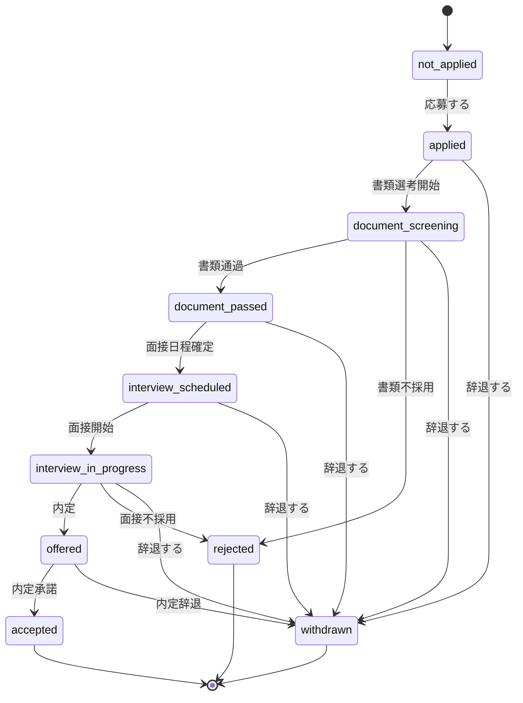

# 選考ステータス状態遷移 要件定義書

## 1. 目的

SOC AI Agent におけるユーザーの応募後の選考状況を、ユーザー・管理者・システムが一貫して扱えるようにする。

本仕様では、選考ステータスの種類、状態遷移、操作権限、画面・APIで必要となる項目を定義する。

## 1.1 この仕様書で作成してほしいこと

初めて上流工程を担当する人は、まず以下を作成する。

| 作成物 | 内容 | 目的 |
| --- | --- | --- |
| 選考ステータス一覧 | 未応募、応募済み、書類選考中、面接中、内定、辞退、不採用などを整理する | 業務上扱う状態を明確にする |
| 状態遷移図 | どのステータスからどのステータスへ進めるかを図で表す | 不正なステータス更新を防ぐ |
| 遷移ルール | 許可する遷移・禁止する遷移を文章で定義する | 実装時の判定条件にする |
| 操作権限表 | ユーザー、管理者、システムができる操作を整理する | 画面・APIの権限制御に使う |
| 画面要件 | ユーザー画面・管理者画面で表示する項目やボタンを整理する | 後続の画面設計につなげる |
| API要件 | 応募作成、ステータス更新、辞退、内定承諾、一覧取得のAPIを整理する | 後続のバックエンド設計につなげる |
| エラー条件 | 重複応募、不正遷移、権限不足などのエラーを整理する | 例外処理やテスト観点に使う |
| 確認事項 | 仕様上まだ決めきれない点を洗い出す | レビュー時に議論できるようにする |

最終的には、開発者がこの仕様書を読めば「どのステータスを持ち、誰が、どの操作で、どこへ遷移できるか」が分かる状態にする。

## 2. 背景

現状のサービスでは、企業マッチング、応募、面接、職務経歴書レビュー、スコア改善が相互に連携する構造を持つ。
その中で選考結果は、以下の後続機能に影響する重要データとなる。

- マッチング精度の改善
- 企業プロファイルの動的更新
- スコアキャリブレーション
- 集合知レコメンド

そのため、選考ステータスを曖昧に登録できる状態ではなく、業務上あり得る遷移に制限する必要がある。

## 3. 対象範囲

### 対象

- ユーザーが企業へ応募した後の選考ステータス管理
- ユーザー・管理者が実行できる操作
- 状態遷移ルール
- 画面表示に必要な項目
- APIで扱う主要項目

### 対象外

- 企業検索・企業推薦ロジック
- 面接AIの質問生成ロジック
- 職務経歴書レビューの評価ロジック
- スコアキャリブレーションの計算式
- メール通知の詳細文面

## 4. 利用者

| 利用者 | 役割 |
| --- | --- |
| ユーザー | 企業へ応募し、自分の選考状況を確認する |
| 管理者 | ユーザーの選考状況を更新・確認する |
| システム | 選考結果をマッチング改善や分析に利用する |

## 5. 選考ステータス定義

| ステータス | コード | 説明 | 終了状態 |
| --- | --- | --- | --- |
| 未応募 | `not_applied` | まだ応募していない状態 | いいえ |
| 応募済み | `applied` | ユーザーが応募した状態 | いいえ |
| 書類選考中 | `document_screening` | 書類選考の結果待ち状態 | いいえ |
| 書類通過 | `document_passed` | 書類選考を通過した状態 | いいえ |
| 面接予定 | `interview_scheduled` | 面接日程が確定した状態 | いいえ |
| 面接中 | `interview_in_progress` | 面接プロセスが進行中の状態 | いいえ |
| 内定 | `offered` | 企業から内定が出た状態 | いいえ |
| 内定承諾 | `accepted` | ユーザーが内定を承諾した状態 | はい |
| 辞退 | `withdrawn` | ユーザーが選考または内定を辞退した状態 | はい |
| 不採用 | `rejected` | 企業側で不採用となった状態 | はい |

## 6. 状態遷移ルール

### 6.1 基本遷移

### 6.2 遷移制約

- 終了状態である `accepted`、`withdrawn`、`rejected` から他ステータスへは原則遷移できない。
- 管理者のみ、業務上の訂正として終了状態から直前状態へ戻せる。ただし操作理由の入力を必須とする。
- `not_applied` から `document_screening` 以降へ直接遷移してはならない。
- `offered` から `rejected` へは直接遷移しない。内定後にユーザーが断る場合は `withdrawn` とする。
- 同一ユーザー・同一企業に対して、同時に複数の進行中選考を作成してはならない。

## 7. 操作権限

| 操作 | ユーザー | 管理者 | システム |
| --- | --- | --- | --- |
| 応募する | 可 | 可 | 不可 |
| 選考ステータスを見る | 可 | 可 | 可 |
| 書類選考中へ更新 | 不可 | 可 | 可 |
| 書類通過へ更新 | 不可 | 可 | 可 |
| 面接予定へ更新 | 不可 | 可 | 可 |
| 面接中へ更新 | 不可 | 可 | 可 |
| 内定へ更新 | 不可 | 可 | 可 |
| 内定承諾 | 可 | 可 | 不可 |
| 辞退 | 可 | 可 | 不可 |
| 不採用へ更新 | 不可 | 可 | 可 |
| ステータス訂正 | 不可 | 可 | 不可 |

## 8. 必須データ項目

| 項目 | 説明 | 必須 |
| --- | --- | --- |
| `id` | 選考管理ID | はい |
| `user_id` | ユーザーID | はい |
| `company_id` | 企業ID | はい |
| `status` | 現在の選考ステータス | はい |
| `applied_at` | 応募日時 | `applied` 以降で必須 |
| `interview_scheduled_at` | 面接予定日時 | `interview_scheduled` 以降で任意 |
| `result_decided_at` | 結果確定日時 | 終了状態で必須 |
| `status_reason` | ステータス変更理由 | 訂正時は必須 |
| `note` | 管理者メモ | 任意 |
| `created_at` | 作成日時 | はい |
| `updated_at` | 更新日時 | はい |

## 9. 画面要件

### 9.1 ユーザー画面

- 応募済み企業の一覧を確認できる。
- 各企業の現在ステータスを確認できる。
- 面接予定日時がある場合は確認できる。
- 進行中ステータスでは辞退操作ができる。
- `offered` の場合は、内定承諾または辞退を選べる。
- 終了状態では操作ボタンを表示しない。

### 9.2 管理者画面

- ユーザー別・企業別に選考ステータスを確認できる。
- ステータスを業務ルールに沿って更新できる。
- 終了状態への更新時は結果確定日時を記録できる。
- ステータス訂正時は理由入力を必須にする。
- ステータス変更履歴を確認できる。

## 10. API要件

### 10.1 応募作成

- `POST /api/applications`
- ユーザーが企業に応募する。
- 同一ユーザー・同一企業で進行中の応募がある場合はエラーにする。

### 10.2 選考ステータス更新

- `PATCH /api/applications/{id}/status`
- 管理者または許可されたシステムがステータスを更新する。
- 遷移不可のステータス更新はエラーにする。

### 10.3 ユーザー辞退

- `POST /api/applications/{id}/withdraw`
- ユーザーが進行中の選考を辞退する。
- 終了状態の場合はエラーにする。

### 10.4 内定承諾

- `POST /api/applications/{id}/accept`
- `offered` の応募のみ承諾できる。

### 10.5 選考一覧取得

- `GET /api/applications`
- ユーザーまたは管理者が選考状況を一覧取得する。
- 管理者は `user_id`、`company_id`、`status` で絞り込める。

## 11. エラールール

| ケース | エラー内容 |
| --- | --- |
| 許可されていないステータス遷移 | `invalid_status_transition` |
| 終了状態から通常更新しようとした | `application_already_closed` |
| 同一企業へ重複応募しようとした | `duplicate_active_application` |
| 権限のないユーザーが更新しようとした | `forbidden` |
| 内定以外を承諾しようとした | `application_not_offered` |

## 12. 受け入れ基準

- 選考ステータス一覧と各ステータスの意味が定義されている。
- 正常な状態遷移と禁止する状態遷移が定義されている。
- ユーザー・管理者・システムの操作権限が整理されている。
- 画面に必要な表示項目と操作が整理されている。
- APIで必要な主要エンドポイントとエラー条件が整理されている。
- 後続の基本設計・詳細設計に進める粒度になっている。

## 13. 確認事項

- 企業側ユーザーを将来的に作るか。
- 選考ステータス変更時にメール通知を送るか。
- 管理者による終了状態の訂正をどこまで許可するか。
- 応募履歴の再応募を許可する場合、どの終了状態から何日後に許可するか。
- 面接が複数回ある場合、`interview_in_progress` の中で詳細ステップを持つか。
