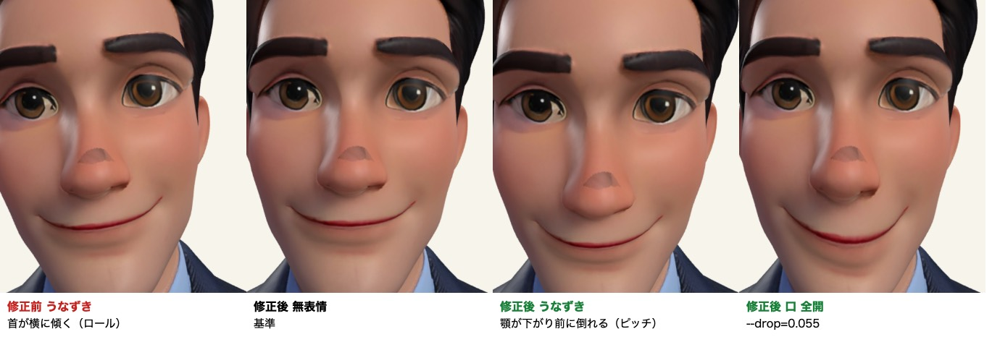

# 面接官アバター

AI面接の面接官として表示する3Dモデルを置く場所。

## いま入っているモデル

`male-avatar.glb` / `female-avatar.glb` は Tripo（画像から3Dを生成するAIツール）製のメッシュに、**`npm run avatar:rig` でうなずき用の骨格を後付けしたもの**。見た目は元のまま変えていない。

```
骨格(skin)   1
モーフ数     1
頭ボーン     Head
口           aa
まばたき     ―     ← 入れられない（理由は後述）
```

**うなずきと口は動く。まばたきは動かない。**

### 元のモデルの状態

後付けする前は、動かすための要素を1つも持っていなかった。

```
generator: Tripo
skins: 0                                   骨格が無い
animations: 0
morph targets: 0                           表情ブレンドシェイプが無い
attributes: POSITION, NORMAL, TEXCOORD_0   JOINTS_0 / WEIGHTS_0 が無い
nodes: 1 / meshes: 1
```

**首の関節も頂点ウェイトも無いので、どんなコードを書いてもうなずかなかった。** `ThreeAvatar.tsx` は口のモーフ検出（多数の命名パターン）と顎ボーンのフォールバックを実装しているが、モデルがどれも提供しないため全部空振りしていた。

### 骨格の後付け（`npm run avatar:rig`）

首の位置を「高さ別の横幅が最小になるところ」で自動検出し、そこから上の頂点を頭ボーンへ割り当てる。境界でいきなり切り替えると回したときに首で面が裂けるので、首の太さを基準に上下へ幅を持たせてなめらかに移す。

実測値:

| | 首の高さ | 頭側に付いた頂点 |
|---|---|---|
| 男性 | 下から58.7% | 65,752（29.2%） |
| 女性 | 下から53.8% | 92,590（36.0%） |

**向きの補正は逆バインド行列に入れる。ジョイントの `rotation` に焼き込んではいけない。**

Tripo の出力は顔が +X を向いていて、正面（+Z）へ向ける -90度/Y が要る。これをルートジョイントの `rotation` に入れると、子である Head の**ローカル軸も一緒に回る**。その状態で `head.rotation.x` を足すと、うなずき（ピッチ）ではなく**首をかしげる動き（ロール）**になる。見た目が同じなので数値を見ているだけでは気付けない。

実測（`npm run avatar:measure`、うなずき6.3度での頭頂の移動）:

```
焼き込みあり（誤り）  head.rotation.x=+0.11 → 頭頂 (-0.0386, -0.0041,  0.0000)  ← ほぼ -X = 真横
焼き込みなし（正しい）head.rotation.x=+0.11 → 頭頂 ( 0.0000, -0.0048,  0.0386)  ← 顎が下がり前へ倒れる
                                              鼻   ( 0.0000, -0.0191,  0.0302)
```



うなずき（6.3度）で辺がどれだけ伸縮するかを測った結果（一意な辺ごと、`npm run avatar:measure`）:

| | 見える辺の最大 | 10%超 | 25%超 |
|---|---|---|---|
| 男性 | 12.79% | 124 / 659,914 | 3 |
| 女性 | 18.37% | 808 / 751,084 | 1 |

率の最大値そのものは男性202%・女性28%だが、どちらも長さ 2e-5〜1e-4 の極小の辺（辺の長さの中央値は 3e-3）で起きていて、目には現れない。判断には「見える辺（長さ1e-3以上）の最大」を使う。

### 口のモーフの後付け（`npm run avatar:mouth`）

顎の形そのものを下げる変位をモーフとして足す。テクスチャには手を触れない。

**唇は離れない。** 描画で確認した事実を先に書く。`mouth=1.0`（音声振幅の常用最大）でも
唇の合わせ目は閉じたままで、口腔も歯も現れない。顎がわずかに伸びるだけである。
8倍に誇張すると下顔面が垂れ下がるが、唇はそれでも閉じている。
モーフが動かす頂点の最大変位の中心は**唇ではなく顎先**にあり、唇は影響の弱い外縁にある。

画素差分で見ると、口の動きはうなずきの約1/7の強度しかない（neutral 比、1040×1240）。

| | 変化画素 | 平均差 |
|---|---|---|
| `mouth=1` | 12.0% | 3.98 / 255 |
| うなずき | 59.0% | 27.1 / 255 |

原因は `scripts/add-mouth-morph.mjs` の `neckY = yMin + H * 0.55` が
**全身モデルの比率をバスト（胸から上）モデルに当てている**こと。`faceH` に首と胸が混入し、
`mouthY = fMin + faceH * 0.28` が唇ではなく顎先に落ちる。

したがって現状の口の動きは「顎がわずかに動く」程度で、見た目の改善としては弱い。
うなずき > 口 > まばたき の優先順で、うなずきは達成済み。口の造形改善は別Issue。

口の位置は解剖学的な比率（顎から上へ28%）から決める。テクスチャの明暗からの検出は、このモデルでは**テクスチャ全体が暗く**（明度の中央値36）成立しなかった。

実装で3回つまずいたので記録しておく。

**1回目: 顔と判定した頂点だけを動かして裂けた**（最大956%伸び）。判定の境界で隣り合う頂点の一方が動かないため。距離による減衰を全頂点へ適用して境界を無くした。

**2回目: 上唇と下唇で動きを変える係数が階段状だった**（`y < mouthY ? 1.0 : 0.45`）。境界をまたぐ辺の両端でウェイトが2倍違い、ここでも裂けた。なめらかに移して 956% → 93% になった。

**3回目: 開き量を上げたまま描画して見ていなかった。** `--drop=0.11`（男性）は数値上は「最大87%伸びる」で、描画すると口が開くのではなく**顎が間延びして唇の絵がにじむ**。唇はテクスチャに描かれているだけなので、顎を大きく下げても「口が開く」にはならず、絵が一緒に伸びるだけである（目を動かせないのと同じ理屈）。

さらに、口の開きは音声振幅で駆動していて、`useInterviewSession.ts` が `Math.min(1, rms*6)` で正規化するので**通常の発話で 1.0 に達する**。つまり「全開の値」は常用される値である。全開がそのまま見られる大きさに下げた。

| | `--drop` | 見える辺の最大 | 25%超 | 動く頂点 |
|---|---|---|---|---|
| 男性 | 0.055 | 47.29% | 841 / 659,914（0.13%） | 4,376 / 225,408（1.9%） |
| 女性 | 0.035 | 30.86% | 83 / 751,084（0.01%） | 4,595 / 257,430（1.8%） |

女性は同じ値だと唇がすぼまって顎が潰れて見えるので別に持つ。**描画して決めること。**

```sh
node scripts/add-mouth-morph.mjs public/avatars/male-avatar.glb   --drop=0.055
node scripts/add-mouth-morph.mjs public/avatars/female-avatar.glb --drop=0.035
```

### モデルを作り直す手順

`add-rig.mjs` は骨格がすでにあるモデルには何もしないので、**元の（加工前の）メッシュから作り直す。**

```sh
# 加工前のモデルは develop の履歴にある
git show origin/develop:frontend/public/avatars/male-avatar.glb > /tmp/male-avatar.glb
node scripts/add-rig.mjs /tmp/male-avatar.glb               # → /tmp/male-avatar-rigged.glb
cp /tmp/male-avatar-rigged.glb public/avatars/male-avatar.glb
node scripts/add-mouth-morph.mjs public/avatars/male-avatar.glb --drop=0.055   # 上書き
npm run avatar:measure   # 数値を測り直してこの README を更新する
npm run avatar:shoot /tmp/avatar-shots   # 描画して目で見る
```

### ファイルサイズ

加工による増加は男性 +1.8MB / 女性 +2.0MB に収めている。

| | 加工前 | 加工後 |
|---|---|---|
| 男性 | 13.0MB | 14.8MB |
| 女性 | 14.4MB | 16.4MB |

- **モーフは sparse accessor**。動くのは 225,408 頂点のうち 4,376（1.9%）だけなので、全頂点ぶんを密に持つと 2.7MB 増える（sparse なら 71KB）
- **`WEIGHTS_0` は正規化 UBYTE**。骨は高々2本なので 1/255 刻みで足り、FLOAT の 16バイト/頂点が 4バイトになる（2.7MB 削減）

`npx gltf-validator` 相当（`gltf-validator` パッケージの `validateBytes`）で **errors 0 / warnings 0 / hints 0**。残る info 2件（`UNSUPPORTED_EXTENSION: FB_ngon_encoding` と `UNUSED_OBJECT /materials/1`）は元のモデル由来。

ウェイト0の枠にジョイント番号を書くと `ACCESSOR_JOINTS_USED_ZERO_WEIGHT` が頂点数ぶん（約14万件）出る。`w > 0 ? 2 : 0` で書き分けること。

## 実際の面接画面での確認結果

`docker compose up -d db redis app` でバックエンドを起動し、フロントを本番ビルドして
Playwright で面接セッション画面まで到達させた結果:

- **アバターが面接画面に描画される**（canvas が生成され、正面を向いて面接官パネルに収まる）
- `inspectAvatar` が複製後のモデルに対して正しく動き、**不足はまばたきだけ**と報告する

```
[ThreeAvatar] アバターモデルが要件を満たしていません: まばたきのモーフが無い
```

つまり頭ボーンと口モーフは実画面でも検出されている。

**まだ確認できていないのは、実際のTTS音声に合わせて動く様子。** 面接の開始には
バックエンドとの通信が必要で、フロントを別ポートで動かすと CORS で弾かれる。
compose のフロントエンド(:3000)を一時停止して同じポートで動かせば確認できる。

### 注意: dev モードでは面接画面まで到達できない

`next dev` だと Suspense のフォールバックから進まず「面接画面を準備しています...」で
止まる。確認するときは `next build && next start` を使うこと。

## 必ず描画して確認する（`npm run avatar:shoot`）

**数値の検証だけでは足りない。** 実際に次の4つは、描画して初めて気付いた。

- 骨を足したことで `ThreeAvatar.tsx` の向き補正（`hasSkeleton ? 0 : -PI/2`）が効かなくなり、**アバターが横を向いた**。-90度/Y を逆バインド行列へ入れて解決
- 口のモーフが**顔ではなく側頭部を動かしていた**。顔の前面を `z > 0` で判定していたが、このモデルは顔が **+X** を向いている
- その -90度/Y を**ジョイントの `rotation` に焼き込んだせいで、うなずきが首かしげになっていた**
- 口の開き量 `--drop=0.11` は**開くのではなく顎が間延びして唇がにじんでいた**

顔の動きは全身の絵では小さすぎて判断できない。`npm run avatar:shoot` は顔に寄せた絵（`-face`）も撮る。

```sh
# frontend 直下で静的サーバを立てる
python3 -m http.server 8099 --directory .
# 別のターミナルで
npm run avatar:shoot /tmp/avatar-shots
```

無表情・うなずき・口を開いた状態を男女ぶん撮る。`scripts/avatar-preview.html` は `ThreeAvatar.tsx` と同じカメラ・照明・正規化で描くので、本番の見え方に近い。

### まばたきが入れられない理由

テクスチャが**1枚のJPEGだけ**（1.2MB / 911KB）で、顔の前面の頂点分布が**ほぼ均一**だった。目や口が立体なら、その高さに頂点が集中する。

```
男性の顔の前面   上から100%  3,988
                 上から 75%  3,928      ← 目の高さに集中が無い
                 上から 25%  6,993
```

つまり**顔のパーツは1枚のテクスチャに描かれているだけ**で、動かす立体が存在しない。

口は顎の形を動かせば描かれた唇もついてくるので成立するが、**目は成立しない。** 目を閉じるには肌で目を覆う必要があるが、頂点を動かしても描かれた目はUVについてくるので隠れない。

テクスチャを差し替える方式（閉じ目の絵を用意して切り替える）なら可能だが、次の2点で自動化できなかった。

- **テクスチャ全体が暗い**（明度の中央値36・最大220）。濃色のスーツが大半を占めるため、「暗い＝目」で位置を特定できない
- **UVが自動生成のアトラスで断片化している**。顔前面の頂点のUVが 4096×4096 のほぼ全域（U 0.007〜0.964 / V 0.018〜1.000）に散っているため、「目の領域」を矩形として取り出せない

まばたきまで必要な場合は VRM へ差し替えること（下記）。

## モデルを差し替えるとき

リグ済み（skin + 頭ボーン）で、まばたき・口のモーフを持つ glTF/GLB を置けば、`inspectAvatar` がそれを見つけて動かす。Ready Player Me の GLB は Oculus ビセーム付きで書き出せば口が動く。

```
https://models.readyplayer.me/[YOUR_AVATAR_ID].glb?morphTargets=Oculus+Visemes&compression=draco
```

商用利用の条件は各自で確認すること。

### VRM は未対応（別Issue）

VRM は人型ボーンの割り当てと表情が規格化されていて本来は最も適しているが、**このPRでは対応していない。** 置いても VRM としては扱わない（`.vrm` は読み込み対象に入っていない）。

VRM を動かすには、`@pixiv/three-vrm` を入れたうえで次がすべて要る。VRMファイルが手元に無く動作確認ができないため、半端な結線を残さず落とした。

- `VRMUtils.rotateVRM0` の適用（VRM 0.x は後ろ向きで出てくる）
- `vrm.update(delta)` を毎フレーム呼ぶ（呼ばないと `expressionManager` の値がモーフへ反映されない）
- `SkeletonUtils.clone` したシーンと VRM インスタンスの対応づけ（`gltf.userData.vrm` は**複製前**のシーンを指すので、そのままではボーンも表情も画面に出ていない側へ書き込む）

### まばたきを入れるには

このモデルには入れられない（上記）。閉じ目のテクスチャを用意して差し替える方式か、目が立体として存在するモデルへの差し替えが要る。

## 置いたモデルが動くかを確かめる

`lib/interview/avatar-capabilities.ts` の `inspectAvatar` が、読み込んだモデルから動かせる部位を洗い出す。足りない部位があれば**ブラウザのコンソールに原因が1行で出る**。

```
[ThreeAvatar] アバターモデルが要件を満たしていません: 骨格（skin）が無い。静止メッシュなので全身が動かせない / 頭・首のボーンが無いのでうなずけない / ...
```

描画は止めない（面接を止めるより、動かないアバターでも面接を続けるほうがよい）。

要件は次の4つ。優先順は「うなずき > 口 > まばたき」で、うなずきは相手が話を聞いていることを示す最小の動作なので、無いと会話として成立しない。

| 要件 | 無いとどうなるか |
|---|---|
| 骨格（skin） | 全身が動かせない |
| 頭または首のボーン | うなずけない |
| 口のモーフ または 顎ボーン | 口が動かない |
| まばたきのモーフ | まばたきしない |

静止メッシュを置いたら検出できることは `tests/lib/interview/avatar-capabilities.test.ts` で固定している。
